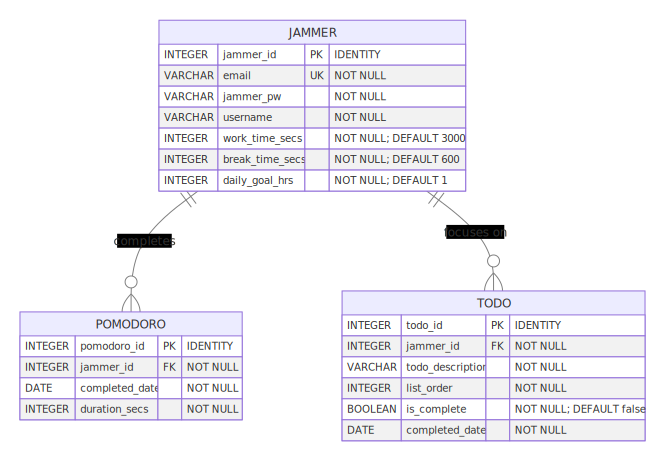

# CS50 Final Project: Jamadoro

## Introduction

This `README` describes my final project for `CS50x`: a server-rendered web
application I've entitled Jamadoro. Jamadoro is a novel take on the classic To
Do app that incorporates a Pomodoro timer that synchronizes timing with a music
player. There is a video demo [available on YouTube](https://www.youtube.com/)
that provides a summary of the features available to users & the technical
decisions made during development. This document provides an
[overview of functionality](#overview), including the goals of the application;
a discussion of [user requirements](#user-requirements), outlining targeted
users & their interests & expectations;
[functional requirements](#functional-requirements) in the form of user
stories, which include details on what the app should do; & a
[technical discussion](#technical-discussion), which describes why decisions
were made regarding the [client-side](#client-side-stack) &
[server-side](#server-side-stack) stacks.

## Running the Project

You can view the
[project running in production](https://jamadoro.shredbert.dev/) -- please note
that deployment & hosting are a work in progress & have a number of errors
currently.

### System Requirements

1. Python 3.10.12
1. Node JS 21.3.0
1. Access to a PostgreSQL database
1. A Spotify developer account
1. Linux

> **Note:** This project hasn't been tested on Windows, although it does not
> have any Windows-specific functionality to the best of my knowledge.

### Instructions

1. Clone repository
1. Configure [environment variables](#environment-variables)
1. Initialize Python virtual environment
    ```
    python3 -m venv .venv
    ```
1. Source virtual environment
    ```
    . .venv/bin/activate
    ```
1. Install Python packages
    ```
    pip install -r requirements.txt
    ```
1. Install Node packages
    ```
    npm install
    ```
1. Build static assets
    ```
    npm run build
    ```
1. Run development server
    ```
    flask run --debug
    ```

## Overview

Practitioners of the Pomodoro technique try to maximize their productivity by
making lists of To Dos; focusing intently on these To Dos one at a time for 25
to 50 minutes; taking a break for 5 to 10 minutes; & repeating this process
until they've worked for an allotted period of time or have completed all of
their To Dos. "Jamming" is slang for intently listening to or playing music.
Jamadoro, therefore, is an application that combines managing To Do lists with
a Pomodoro timer that can integrate with Spotify so that users can "jam out" to
music in sync with their focused work, thereby improving their productivity.

### Spotify Integration

For users with Spotify accounts, Jamadoro allows them to sign in to Spotify
using the [OAuth 2.0](https://oauth.net/2/) protocol to automatically play
music while a Pomodoro is in progress & pause music while a break is in
progress. This uses the Spotify Web API to control playback, which allows
Jamadoro to trigger the playing & pausing of any open Spotify players as long
as the user _has a Spotify player open._ Users can manually start or stop the
playback of music during their Pomodoros by using their Spotify player; as long
as Jamadoro is connected to Spotify, it will continue to start playback during
Pomodoros & pause it during breaks.

> **Note:** Jamadoro **does not** embed a Spotify player that can be controlled
> directly -- rather, a Spotify app **must also be open** by the user on at
> least one device; Jamadoro can then be used to toggle playback functionality
> within that player in conjunction with the Pomodoro timer.

## User Requirements

### User Profiles

**Productivity Pete:** Pete loves using To Do lists & the Pomodoro technique
because they have helped him improve his productivity significantly. However,
he's getting an RSI from having to write down his To Dos on paper & set his
kitchen timer by hand so often. (He also finds these manual activities very
distracting from what he actually cares about -- his work!) Pete would love an
app that helps him skip straight to completing his Pomodoros using a "set it &
forget it" approach that he doesn't have to work hard to manage. He's clearly a
bit of a luddite so he's skeptical of technology in general & wants any app he
relies on to value his information security by enforcing good security
standards.

**Flow State Francine:** Francine loves working while listening to lo-fi beats
because she finds they help her get "in the zone" while working. She avidly
uses the Pomodoro technique in conjunction with To Do lists so that when she
works, she is as focused on her work as she can be. However, she has to
manually play music during Pomodoros & pause it during breaks, as well as
switch to her To Do app to cross off To Dos, each of which interrupts her flow
significantly. Ideally, she would like her music playback to sync with her
Pomodoros & be able to cross items off her To Do list without opening yet
another app.

**Metrics Mike:** Mike loves tracking his work & wants to be able to view the
amount of time he has spent doing focused work. He wants to use this
information to look for trends in his productivity so that he can find areas
for improvement & become even more productive. He is also very competitive &
finds comparing his levels of productivity with others to be very motivating.

### Non-Functional Requirements

-   Is the UI intuitive to use & easy to remain distraction-free from when it's
    open?
-   Does the app feel responsive & performant?
-   Does the app look welcoming & friendly so I want to use it daily?
-   Does the app help me feel encouraged & motivated to keep using it so I'm
    more productive?
-   Does the app include modern quality of life niceties, such as theming?

## Functional Requirements

### Backlog

| **Backlog**               | **Design** | **Development** | **Complete**            |
| :------------------------ | :--------- | :-------------- | :---------------------- |
|                           |            |                 | Log in to app           |
|                           |            |                 | Complete sessions       |
|                           |            |                 | Manage session settings |
|                           |            |                 | Listen to jams          |
|                           |            |                 | Manage To Dos           |
| Choose Jams               |            |                 |                         |
| View Productivity History |            |                 |                         |
| View Productivity Ranking |            |                 |                         |

### Log in to app

#### User Story

As **Productivity Pete,** I want to log in to Jamadoro so my settings &
progress can persist between sessions but my personal information is secure.

#### Acceptance Criteria

-   Can I register an account if I don't have one yet?
-   Can I log in to & out of Jamadoro?
-   Can I use my password manager to save & enter my credentials?
-   Can I change my password once I'm logged in?

#### Future Criteria

-   Do I get a confirmation email upon registering to ensure I entered a valid
    email address?
    -   Is my account deactivated if I do not confirm within 30 days?
-   Can I use 2FA, including via text, email, & authenticator app?
-   Can I reset my password using email if I forget it?
-   Can I create an account using a common SSO provider that supports OpenID
    Connect for secure authentication?

### Complete sessions

#### User Story

As **Productivity Pete,** I want to time my Pomodoros & breaks so I can more
easily get into a flow state but am reminded to regularly recharge my focus,
both of which will help me improve my productivity.

#### Acceptance Criteria

-   Can I start, pause, & resume the Pomodoro timer?
-   Can I reset the Pomodoro timer?
-   Does a break start as soon as a Pomodoro is done?
-   Does a Pomodoro start as soon as a break is done?
-   Can I view how much time is left in a Pomodoro or break?
-   Can I view how many Pomodoros I've completed today?
-   Can I view my daily goal, & does it stay up to date between opening/closing
    Jamadoro?
-   Do I receive notifications in conjunction with the timer?
    -   Am I notified when a Pomodoro is complete?
    -   Am I notified when a break is complete?
    -   Am I notified when I've met my daily goal?
    -   Can I toggle notifications on & off?

#### Future Criteria

-   ???

### Manage Session Settings

#### User Story

As **Productivity Pete,** I want to configure my Pomodoro length, break length,
& the number of Pomodoros I'd like to complete in a session so I can tailor
Jamadoro to my preferences & goals.

#### Acceptance Criteria

-   Does Jamadoro default to a work time of 50 minutes, a break time of 10
    minutes, & a daily session goal of 1 hour?
-   Can I select a **total time** of 15, 30, 45, or 60 minutes?
    -   Is the work time automatically set to 12.5, 25, 37.5, or 50 minutes
        respectively?
    -   Is the break time automatically set to 2.5, 5, 7.5, or 10 minutes
        respectively?
-   Can I select the amount of time to spend working in a day, between 1 & 8
    hours?
-   Do my settings persist when I next open Jamadoro?
-   Does progress towards my daily goal reset each day?

#### Future Criteria

-   Can I choose to sync my work/break time within actual clock time instead of
    a manual timer?
    -   Can I select the amount of time to work?
        -   Does the work time default to on the hour until 50 minutes past the
            hour?
    -   Can I select the amount of time to break?
        -   Does the break time default to 50 minuts past the hour until the
            top of the next hour?

### Listen to jams

#### User Story

As **Flow State Francine,** I want to listen to Spotify while completing
Pomodoros so I can listen to music that helps me get into a flow state without
having to manually play or pause it.

#### Acceptance Criteria

-   If I'm not signed in to Spotify, can I choose to sign in?
-   If I don't have any Spotify players open, do I get an error message?
    -   Can I easily open the Spotify web player from Jamadoro?
-   If I'm signed in to Spotify & a Spotify player is open, does music play
    when a Pomodoro timer is in progress & pause when it is not?
    -   If Spotify is connected & playing, can I see the Spotify track info?
-   If I have multiple Spotify players open at once, does Jamadoro
    automatically select the one to control playback for in order from desktop
    to web to mobile instances?

#### Future Criteria

-   Can I toggle whether Spotify playback is synced with Jamadoro without
    signing out of Spotify altogether?
-   If I open Spotify through Jamadoro, does Jamadoro open the desktop app (if
    it's installed) before opening the Spotify web player?
-   Can I choose from other popular music players such as SoundCloud, Apple,
    Google, or Amazon?

### Manage To Dos

#### User Story

As **Flow State Francine,** I want to be able to view & cross off the To Dos
that I'm working on so I can focus better on each To Do during Pomodoros & move
to the next one without context switching out of Jamadoro.

#### Acceptance Criteria

-   Can I create a list of To Dos in the order I wish to complete them in?
-   Can I edit & delete the To Dos in my list?
-   Can I reorder the To Dos in my list?
-   Does each To Do get displayed 1 at a time, in order, near my Pomodoro
    timer?
    -   Can I check off my To Dos as I've completed them while not navigating
        away from my Pomodoro timer?
    -   Is the first To Do in my list always displayed next to my Pomodoro
        timer?
    -   Once I've checked off the current To Do, is the next one in the list
        displayed automatically for me to work on next?
    -   Do I see an appropriate message when I don't have any To Dos left to
        display in my list?
-   Do the incomplete To Dos in my list remain the next time I open Jamadoro?
-   Is an appropriate message displayed when I have no more To Dos remaining?

#### Future Criteria

-   Can I toggle the To Do list integration on & off if I don't wish to use To
    Dos at all?
-   Can I integrate with other popular To Do apps if I don't wish to use
    Jamadoro?

### Choose Jams

#### User Story

As **Flow State Francine,** I want to select what music Spotify is playing so I
don't have to leave Jamadoro to change my jams.

#### Acceptance Criteria

-   ???

#### Future Criteria

-   Can I select from a list of my top 10 albums/playlists to play in Spotify?
-   Can I select from a list of curated albums/playlists dedicated specifically
    to focused work to play in Spotify?

### View Productivity History

#### User Story

As **Metrics Mike,** I want to view information about the amount of time I've
spent doing Pomodoros so I can monitor trends in my abilities to complete
focused work.

#### Acceptance Criteria

-   ???

#### Future Criteria

-   Can I view all the To Dos I've completed, listed per period of time?
-   Can I view the daily average length of time I've spent completing
    Pomodoros?
-   Can I view the days of the week I've completed the most Pomodoros on in
    order from most to least?
-   Can I view the percentage of days where I reached my daily work session
    target on days where I completed at least 1 Pomodoro?
-   Can I view the percentage of days where I reached my daily work session
    target out of all days where I've been using Jamadoro?
-   Can I visualize my productivity data, including the amount of time spent
    doing Pomodoros by year, quarter, month, week, & day?

### View Productivity Ranking

#### User Story

As **Metrics Mike,** I want to see how the amount of time I've spent completing
Pomodoros compares with other Jamadoro users so I can be motivated to improve
my productivity levels.

#### Acceptance Criteria

-   ???

#### Future Criteria

-   Can I view the top 10 users of Jamadoro, ordered by time spent completing
    Pomodoros in the past week starting from the current day?
-   Can I view where I rank in the Jamadoro leaderboards?

## Technical Discussion

This project uses the core technologies taught by CS50x during the web
development lectures, with several exceptions made for educational/research
purposes. For client-side web technologies, Bootstrap 5.3 is used for most
presentational styles & scripting & is customized to reduce bundle size;
JavaScript `fetch` requests are used for AJAX features. The server uses Flask &
Python, as per CS50x, while the database is Postgres, connected to by
SQLAlchemy instead of the CS50x Python library -- this is for research purposes
to see how difficult it is to connect to the database without the help of CS50.

### Methodology

Jamadoro is created with the principles of server-rendered, hypermedia-first
architecture, based on the idea of
[Hypermedia as the Origin of Application State](https://htmx.org/essays/hateoas/).
My interpretation of this idea is that modern "RESTful" (i.e., JSON) APIs have
one of several drawbacks for predominantly server-rendered applications. The
most notable of these is the addition of sometimes significant complexity to
client-side code: The more complexity that is added to the client, the larger
the bundle size of static assets. Furthermore, since so much logic is already
authored on the [server](#web-server), returning HTML that is already modified
in keeping with application state reduces overall complexity by enforcing said
complexity in a single place.

As an example, take the Jamadoro Progress Card component. This card shows the
user's daily work time goal & the number of hours they've worked. This card is
rendered as part of the entire page on initial load, then must be updated every
time the user completes a session of work.

The HTML included on the initial load looks similar to the following -- note
the heavy use of Jinja templating to format the number of hours:

```html
<div class="card-header d-flex align-items-center">
    <span>Progress</span>
</div>
<div class="card-body d-flex flex-row justify-content-center">
    <div class="d-flex flex-column align-items-end w-50 me-1">
        <span class="fw-bold">Daily Goal:</span>
        <span class="fw-bold">Time worked:</span>
    </div>
    <div class="d-flex flex-column align-items-start w-50 ms-1">
        <span data-goal="{{ user_settings["daily_goal_hrs"] }}" id="sessionGoal">{{ user_settings["daily_goal_hrs"] }} hours</span>
        {# Display to 2 decimals if not whole number, else just int #}
        
            {% if dur % 1 == 0 %}
                <span data-progress="{{ "%.f"|format(dur) }}" id="sessionsToday">{{ "%.f"|format(dur) }} hours</span>
            
                <span data-progress="{{ "%.2f"|format(dur) }}" id="sessionsToday">{{ "%.2f"|format(dur) }} hours</span>
            
        
    </div>
</div>
```

For updating the card as the user makes progress, the server initially exposed
a JSON API, which transmitted only data (in this case, the user's daily session
goal & how many hours they'd completed in the day already). This meant that the
card had to be rendered on the client using different methods to display state
than the above template. This initially looked something like this:

```js
function updateProgressCard(data) {
	const durHrs = data.duration_secs_today / 3600;
	const newCard = `
		<div class="card-header d-flex align-items-center">
			<span>Progress</span>
		</div>
		<div class="card-body d-flex flex-row justify-content-center">
			<div class="d-flex flex-column align-items-end w-50 me-1">
				<span class="fw-bold">Daily Goal:</span>
				<span class="fw-bold">Time worked:</span>
			</div>
			<div class="d-flex flex-column align-items-start w-50 ms-1">
				<span data-goal="${data.daily_goal_hrs}" id="sessionGoal">${data.daily_goal_hrs} hours</span>
				// Display to 2 decimals if not whole number, else just int
				<span data-progress="${durHrs}" id="sessionsToday">${durHrs} hours</span>
			</div>
		</div>
	`;
	document.getElementById("progressCard").innerHTML = newCard;
}

const timerElement = document.querySelector("lit-interval-timer");
if (timerElement) {
	timerElement.addEventListener("timerDone", (event) => {
		// ...
		fetch(requestUrl, requestProps)
			.then((response) => {
				if (!response.ok) {
					throw new Error(`HTTP error: ${response.status}`);
				}
				// JSON parsed instead of HTML
				return response.json();
			})
			.then((data) => {
				updateProgressCard(json);
				displayToastMessage(
					"success",
					"Pomodoro complete -- rock on!!! 🤘🤘🤘"
				);
			});
		// ...
	});
}
```

> **Note:** The HTML `<template>` element could have been used instead of the
> template literal above, making client-side rendering more declarative;
> however, this would have still had the drawback of increased complexity &
> duplication of effort.

On their own, the client & server templates are roughly equivalent; however,
the UI for the card must now be maintained in two places. In light of this, I
believe that the most maintainable solution long-term is to utilize the
principle of
[separation of concerns](https://en.wikipedia.org/wiki/Separation_of_concerns)
by having this complexity live exclusively in one place. This could mean that
the card should be rendered exclusively on the client, even on initial page
load; however, this has the drawback of increasing our bundle size & being
inconsistent with the rest of our application. (This approach could also
provide a negative user experience if the JavaScript fails to load or renders
more slowly on the initial page load.)

Alternatively, using the server to render the "foundation" of the UI (including
all application state) has none of these drawbacks related to maintainability
or performance. The current JavaScript to update the card is much simpler:

```js
function updateProgressCard(html) {
	// No JS template literals required to render the UI with application state
	document.getElementById("progressCard").innerHTML = html;
}

const timerElement = document.querySelector("lit-interval-timer");
if (timerElement) {
	timerElement.addEventListener("timerDone", (event) => {
		// ...
		fetch(requestUrl, requestProps)
			.then((response) => {
				if (!response.ok) {
					throw new Error(`HTTP error: ${response.status}`);
				}
				// Text (i.e., HTML) parsed instead of JSON
				return response.text();
			})
			.then((html) => {
				updateProgressCard(html);
				displayToastMessage(
					"success",
					"Pomodoro complete -- rock on!!! 🤘🤘🤘"
				);
			});
		// ...
	});
}
```

> **Note:** This solution may have other issues associated with it, such as
> making the app vulnerable to having HTML injected into the DOM (i.e.,
> Cross-Site Scripting). I am currently looking into whether this presents an
> issue, but I am optimistic due to the large number of
> [security provisions from Jinja](https://flask.palletsprojects.com/en/2.3.x/security/#cross-site-scripting-xss)
> when generating HTML templates.

### Client-Side Stack

#### Build Tools

Because the Node.js ecosystem provides the most comprehensive set of front-end
tooling, it was used to build all static assets from source. Source files are
located in the `./static/src/` directory & are output to `./static/public/`,
where they are loaded by the Jinja templates. The JS implementation of Sass is
used to bundle CSS code & transpile Sass into CSS, while PostCSS is used for
autoprefixing CSS properties that are not standard across all browsers &
minifying styles. Rollup is used to bundle & minify JavaScript assets -- Web
Components are converted using native ES Modules, while Bootstrap & custom
scripts are output to IIFE format for browser execution. My general approach to
bundling can be described further in the
[Lit documentation](https://lit.dev/docs/tools/production/#building-with-rollup).

> **TODO:** Route HTML templates through build tools to automatically update
> links to hashed assets.

#### CSS

[Bootstrap 5.3](https://getbootstrap.com/docs/5.3/getting-started/introduction/)
is used to provide pre-built styles, UI components, CSS helpers, & utility
classes. Bootstrap 5.3 is used, which enables the use of modern features such
as toggling between light & dark mode. Themes are set automatically based on
the user's `prefers-color-scheme` preference & is handled through JavaScript.
Sass imports are used to include only the Bootstrap code that is required for
the final bundle; it also enables some customization, such as the addition of
custom width utilities using Sass mixins. Supported browsers are defined in
`./.browserslistrc` -- this is used by the PostCSS Autoprefixer plugin for
modifying CSS as needed to ensure cross-browser compatibility.

#### JavaScript

AJAX-style JavaScript is used for updating portions of UI for the user without
reloading the entire page. As described in the above
[methodology section](#methodology), this is done almost entirely by submitting
form requests & parsing HTML text that is then loaded into the DOM. The
JavaScript
[`fetch()`](https://developer.mozilla.org/en-US/docs/Web/API/Fetch_API) API is
used for these requests, as this seems to be the industry-standard means of
interacting with a server through JavaScript due to providing a modern
asynchronous, promise-based API.

Additionally, presentational JavaScript is used for UI interactions, such as
presenting toast messages, tooltips, dropdown menus, & dismissing alerts. All
presentational JavaScript relies on the Bootstrap JavaScript library, which
only imports the required modules.

#### Web Components

[Web Components](https://developer.mozilla.org/en-US/docs/Web/API/Web_Components)
are a collection of browser-native technologies that allow for custom HTML
elements to be created. This has the primary benefit of reducing code
complexity by abstracting away the internal markup & logic of UI elements.
Additionally, Web Components are portable between applications since they are
largely compatible with every browser & framework (both client- & server-side).

Web Components were selected for educational & maintainability purposes since
they are a browser-native technology. While alternatives such as Svelte, React,
or Vue could be used for the componentization of client-side UI code, they
would likely increase bundle size & code complexity significantly more.
Further, browser-native technologies are generally more maintainable over time,
since they are significantly less likely to experience breaking changes or
support issues in the future.

However, Web Components do have drawbacks compared to server-rendered templates
because they must be loaded & executed on the client. This increases the bundle
size for static assets, loading time for users, & may result in other UX issues
(such as a
[Flash Of Unstyled Content (FOUC)](https://en.wikipedia.org/wiki/Flash_of_unstyled_content)).
Therefore, because Jamadoro is a predominantly
[server-rendered application](#methodology), web components are only used in
situations where exclusive client-side execution is already mandatory. This
means that components such as navigation, dropdown menus, & toast messages
should be rendered in Jinja on the server & styled directly using CSS. Only the
**Jamadoro timer component** was created as a web component since the timing of
work cannot be done on the server due to increased performance & latency costs.

To develop the timer component, the [Lit Element](https://lit.div) library is
used. Web Components are a very low-level browser API that require developers
to manually handle several
[lifecycle callbacks](https://developer.mozilla.org/en-US/docs/Web/API/Web_components/Using_custom_elements#responding_to_attribute_changes).
While this is not difficult, code that abstracts away some of this complexity
seems more maintainable to me; furthermore, Lit is a very well-established
Google library that seems unlikely to be abandoned anytime soon. Furthermore,
the more web components that are authored for use in Jamadoro will see
increasing returns based on the presence of Lit, since the library will only
have to be loaded once for all components.

### Server-Side Stack

#### Web Server

In keeping with the CS50x web lectures, the server application uses Python &
[Flask](https://flask.palletsprojects.com/en/3.0.x/). My Jamadoro development
environment uses the Python [venv](https://docs.python.org/3/library/venv.html)
module for dependency portability between systems and
[SQLAlchemy](https://www.sqlalchemy.org/) to connect to the database. Cookies &
server session state are configured using the Flask-Session module.

Of particular note is the approach to login adopted from the CS50x lectures,
which leverage Python decorators -- these "wrap" all Flask routes that require
the user to be logged in, thereby simplifying the process of checking whether
the user has been authenticated:

```python
def is_logged_in(func):
    @wraps(func)
    def decorator(*args, **kwargs):
        if "jammer_id" not in session:
            return redirect(url_for("login"))
        return func(*args, **kwargs)
    return decorator
```

To connect to Spotify, the
[Spotify Web API](https://developer.spotify.com/documentation/web-api) is used.
This uses the OAuth 2.0
[Authorization Code Flow](https://developer.spotify.com/documentation/web-api/tutorials/code-flow)
to grant users with Spotify accounts access to their Spotify data. Of
particular note in this workflow is that once the user is navigated away from
Jamadoro to Spotify for login, the browser loses track of their session. In
order to continue their previous Jamadoro session once Spotify redirects them
back to Jamadoro, the session cookie's ID is initially passed to the Spotify
API using the `state` parameter, which is then sent to Jamadoro upon
redirection. This technique was adopted based on the
[OAuth 2.0 documentation](https://www.oauth.com/oauth2-servers/redirect-uris/redirect-uri-registration/)
discussion of combining OAuth 2.0 & stateful applications.

> **Note:** This means of session management between separate sites has not
> been vetted for security issues since the `state` parameter is usually a
> randomized token used for validation purposes. Initially, my plan was to
> generate the `state` parameter, join it with the user's session ID, parse the
> two after the user is redirected, validate the `state` parameter, & then
> continue their session, but this was very complicated in practice due to the
> limited set of characters available to split strings in URLs that **were
> not** used within session IDs. This is currently being researched for issues
> & possible solutions as necessary.

#### Database

Database constraints are used to enforce data integrity at a basic level, such
as through `PRIMARY KEY`, `FOREIGN KEY`, & `CHECK` contraints.
[Database procedure language](https://www.postgresql.org/docs/current/plpgsql.html)
is avoided to avoid vendor lock in, as procedure languages tend to be less
standardized as SQL itself. If triggers or significantly increased performance
are required, procedure language may be adopted as needed.

Postgres is used in place of SQLite because it is a more traditional &
feature-rich RDBMS for large-scale applications. It also allowed me to gain
some insight into the administration workflow for configuring databases, such
as creating DB schemas & users on Linux. While eventually the database should
be deployed to its own server, this project deploys it to the same server as
the Python web server to reduce the cost & maintenance work for hosting
Jamadoro. Valid ranges of values for work time, break time, daily goals, & time
worked (in seconds) are all enforced using `CHECK` constraints to help maintain
data integrity. No views or indexes were used due but may be required for
future features that require significant amounts of data.

The schema is defined in `./sql-scripts/load-schema.sql`, as per the following
Entity Relationship Diagram:

<figure>
	
	<figcaption>Jamadoro Entity Relationship Diagram</figcaption>
</figure>

#### Environment Variables

All private application info, including Spotify secrets & Postgres database
credentials, must either be included in a `.env` file or defined on the system
that Jamadoro is being run on as environment variables. The `python-dotenv`
module is
[automatically used by Flask](https://flask.palletsprojects.com/en/2.3.x/cli/#environment-variables-from-dotenv)
during development if it is installed; however, because this library is
required by Jamadoro in production, the `python-dotenv` module is manually
imported into each script that uses environment variables so as to make
deploying to production easier.

The required Spotify environment variables are:

```
CLIENT_ID
CLIENT_SECRET
REDIRECT_URI
```

The required Postgres environment variables are:

```
POSTGRES_USR
POSTGRES_PW
POSTGRES_PORT
POSTGRES_SCHEMA
```

Finally, the `NODE_ENV` & `PY_ENV` environment variable must be set to either
`production` or `development` -- this impacts the building of static assets &
Gunicorn configurations, respectively.

#### Deployment

This project was developed on Debian 12 running on WSL2 on the Windows 10/11
operating systems. [Gunicorn](https://docs.gunicorn.org/en/stable/index.html)
is configured as the WSGI server to serve the Flaks application, with most
required settings outlined in `gunicorn.conf.py`.
[nginx](https://nginx.org/en/docs/) is configured as a reverse proxy to allow
for improved security & performance. Hosting is provided by Digital Ocean & the
app is running on an Ubuntu 22.04 VM. Long-term, I would like to investigate
adding a CI/CD pipeline to provide automated testing & deployment.

Efforts are made to adhere with
[current industry performance recommendations:](https://csswizardry.com/2023/10/the-three-c-concatenate-compress-cache/)

1. **Caching:** Static files are cached for as long as possible by hashing them
   using the `Flask-Assets` library & leveraging the `Cache-Control` header
    1. `Cache-Control: max-age` for static assets is customizable in Flask
       using the `SEND_FILE_MAX_AGE_DEFAULT` parameter
    1. While industry recommendations are to also add the `immutable`
       parameter, this is not currently exposed by the Flask API -- this
       requires further investigation
1. **Concatenate:** Static files are minified & bundled to single `css` & `js`
   files using the `npm build` script
1. **Compress:** `gzip` compression by `nginx` is enabled for static files via the
   `nginx.conf` file
